# Architecture

## Pipeline

```mermaid
flowchart LR
    classDef shipped fill:#dcffe4,stroke:#22863a,color:#000
    classDef opkey   fill:#fff5b4,stroke:#c69400,color:#000

    Py["CPython stdlib<br/>(building interpreter; pin open in #115)"]:::shipped --> Insp["inspect-based loader<br/>emb_shootout.corpus.build_corpus()"]:::shipped
    Insp --> Chunks["Chunks<br/>(chunk_id, text, module,<br/>qualname, kind, source)"]:::shipped
    Chunks --> JSONL[("data/corpus.jsonl<br/>≥10k records<br/>(#1)")]:::shipped

    JSONL --> Queries["Held-out queries<br/>emb_shootout.queries<br/>(#2, D-005)"]:::shipped
    JSONL --> Sweep["Sweep harness<br/>emb_shootout.sweep.run_sweep()<br/>(#2, D-004)"]:::shipped
    Queries --> Sweep
    Sweep --> Hash["hash baseline<br/>results/hash.json<br/>(shipped, runs in CI)"]:::shipped
    Sweep --> Real["OpenAI · Voyage · Cohere · BGE · Nomic<br/>results/&lt;provider&gt;.json<br/>(harness ready, gated on operator API keys)"]:::opkey

    Hash --> Agg["Aggregator<br/>emb_shootout.sweep.aggregate_markdown()<br/>(#11, D-007)"]:::shipped
    Real --> Agg
    Agg --> Bench[("docs/benchmarks.md")]:::shipped

    Hash --> Pareto["Pareto frontier<br/>emb_shootout.pareto.pareto_frontier()<br/>(#3, D-008)"]:::shipped
    Real --> Pareto
    Pareto --> Plot["Matplotlib renderer<br/>emb_shootout.plot<br/>(behind [plot] extra)"]:::opkey
    Plot --> PNG[("docs/pareto.png<br/>(committed when ≥2 points exist)")]:::opkey

    JSONL --> Notebook["notebooks/reproduce.ipynb<br/>+ notebooks/_verify.py<br/>(#5)"]:::shipped

    classDef _legend stroke-dasharray:3 3
```

Green nodes ship today and run in CI on every PR. Yellow nodes are wired
end-to-end but the data is operator-supplied: the paid-provider sweeps
need an API key, and the matplotlib Pareto renderer needs `pip install
'.[plot]'` plus a second non-`hash` result so the frontier has more than
one point to draw (D-008 documents the honest no-frontier rendering
until that second point exists).

## Components shipped

- **`emb_shootout.corpus`** — `build_corpus(modules)` returns a generator
  over `Chunk` records; `DEFAULT_MODULES` is the curated stdlib list
  (#1). `write_jsonl(chunks, path)` is the deterministic JSONL writer.
- **`emb_shootout.queries`** — derives the held-out query set from the
  corpus at sweep time with a fixed seed (D-005). No pre-committed
  queries; corpus and queries cannot drift apart.
- **`emb_shootout.sweep`** — `Embedder` Protocol, `run_sweep(corpus,
  queries, *, embedder)`, `aggregate_markdown(results_dir)`. One JSON per
  provider (D-007), aggregator is pure-read so concurrent operator runs
  don't collide.
- **`emb_shootout.providers`** — six implementations: the dep-free
  `hash-embedder-128d-ngram2` baseline that runs in CI on every PR, plus
  OpenAI / Voyage / Cohere / BGE / Nomic behind optional extras
  (D-004). Each is exercised by its own unit test against a stub HTTP
  response shape, so the wire format is locked even when no API key is
  configured. Constructor arguments are validated **before** each
  provider's lazy import, from one definition in
  `emb_shootout/_argcheck.py` (#141). #33 established that for
  `batch_size` and stated two reasons — a fast `ValueError` instead of a
  slow ImportError-then-network-init, and a check that is testable
  without the extra installed — and both cover `dim` and
  `cost_per_million_tokens` just as exactly, while neither was validated
  in any of the five. Measured with no extras installed: `batch_size=0`
  raised `ValueError` from all five, `dim=-1` and `cost=nan` raised
  `ImportError` — misconfigurations no test could reach. The rules are
  *derived from* `SweepResult.__post_init__` (#31) and
  `_require_declared_dim` (#112) rather than written afresh, because a
  provider-side rule even slightly stricter would refuse a sweep the
  harness would have accepted; `tests/test_provider_arg_domain.py`
  asserts the two domains are identical, and that the downstream guards
  still fire. This moves the moment, not the contract.

  **And the identity axis, which every guard in `SweepResult` had
  skipped (#143).** `__post_init__` was completed one field at a time —
  #29/#31 (cost, dim, counts), #31 again (recall/ndcg values), #65
  (`embed_latency_ms` values), #133 (`notes` elements) — and every one
  of those is a rule about a **value**. `from_dict` validates two things
  about **identity** that `__post_init__` did not: `embedder_name` must
  be a non-empty `str` (#94/#95), and every `recall_at_k` key must be
  the canonical spelling of a positive integer (#129). `embedder_name`
  was checked *not at all* — the only field in the class with zero
  guards — so `to_dict` wrote result JSON under `results/` that this
  package's own `from_dict` refuses. That is the asymmetry the cost guard itself had
  already closed and said so: "`from_dict` already rejects a bool cost
  pre-coercion (#108); this closes its direct-construction sibling."

  Both harms `from_dict`'s guard comment names were reachable through
  the constructor and are now measured: five of six bad names crash
  `aggregate_markdown` with a raw `AttributeError` from
  `.replace("|", ...)`, and `sorted(results, key=...embedder_name)`
  over a mixed batch raised `TypeError`. Two rows are *silent* and are
  the reason this is a guard rather than six tracebacks —
  `embedder_name=""` constructs, renders an **empty embedder column**
  into the published README table, and writes a result file nothing
  complains about until it is reloaded; and a string `recall_at_k` key
  round-trips into an `int` key, so
  `from_dict(r.to_dict()).recall_at_k != r.recall_at_k` with no error
  anywhere.

  One definition each: the name rule is `_argcheck.is_non_empty_str`,
  now called from both seams, and the key range delegates to
  `validate_k_values` — the same rule `run_sweep` applies before
  *producing* these keys and the one `_coerce_recall_keys` uses on the
  way back in, so all three agree on `k >= 1` by construction. The key
  *type* arm has to run before the range arm, because `sorted()` over
  mixed key types raises a raw `TypeError`. `from_dict` keeps its own
  guards, and they are not redundant: `_coerce_recall_keys` turns `"05"`
  into a perfectly good `int` 5 before the constructor sees it, so the
  canonical-spelling rule #129 exists for has nothing left to object to
  by then.
- **`emb_shootout.pareto`** — pure-Python `pareto_frontier(results)`
  over (cost-per-million, recall@5) pairs (D-008). The frontier
  computation is dep-free so it runs in the standard CI matrix.
- **`emb_shootout.plot`** — matplotlib renderer behind the `plot`
  extra. Frontier computation is upstream of rendering; if `plot`
  isn't installed, the frontier is still computable as JSON.
- **`emb-shootout`** — argparse CLI: `corpus build`, `corpus validate`
  (#45), `sweep run`, `sweep aggregate`, `sweep plot`. Each subcommand
  has a `--help` surface; the public-surface lock (#13,
  `tests/test_public_surface.py`) pins the top-level package's `__all__`
  and the CLI entry-point in `pyproject.toml`.
- **`emb_shootout.validate`** — `validate_corpus(path)` walks a corpus
  JSONL in collecting mode and returns a `ValidationReport` with one
  `ValidationFinding` per malformed row (#45). Same pattern as
  `eval_harness.dataset.validate_dataset` and `prompt_regression.validate`
  in the sister repos: twelve finding codes (`malformed_json`,
  `not_an_object`, `missing_chunk_id`, `missing_text`,
  `non_string_chunk_id`, `non_string_text`, `empty_chunk_id`,
  `empty_text`, `unencodable_chunk_id`, `unencodable_text` (a lone
  surrogate, #176), `duplicate_chunk_id`, `empty`), CLI exit codes 0 / 1 / 2
  uniform with `eval-harness validate`. Pre-flight before `sweep run`
  spends embed time on a broken corpus.
- **`notebooks/reproduce.ipynb`** + **`notebooks/_verify.py`** —
  walk corpus → queries → hash baseline sweep → markdown aggregation
  → Pareto plot end-to-end (#5). Five shape tests pin the notebook's
  import surface and assert no cached outputs ship.
- **`scripts/capture_demo.sh`** — three-surface 60-second demo driver
  for the README's Demo section (#15). Single-module corpus, single
  provider (hash), deterministic. `tests/test_capture_demo_smoke.py`
  runs it in CI with `CAPTURE_PACE_SECONDS=0`.

## Locked outputs

These outputs are checked at the byte level by snapshot tests so they
can't drift from the code that produces them:

- **`docs/benchmarks.md`** — `tests/test_benchmarks_md_snapshot.py`
  rebuilds the table by calling `aggregate_markdown(results/)` and
  byte-compares to the committed file. Belt-and-braces with the
  README "Takeaways" section locked by `tests/test_readme_snapshot.py`
  (#4).
- **`results/hash.json`** — committed; the in-CI baseline so the
  aggregator and snapshot tests have at least one real result to
  exercise.
- **README "Takeaways"** — locked to `results/hash.json` (#4).

## What's still operator-supplied

- Paid-provider sweeps (OpenAI / Voyage / Cohere / BGE / Nomic).
  The acceptance criterion for #2 had two parts: the harness, and the
  numbers. The harness shipped; the numbers cost real money and live
  with the operator, not in CI.
- A two-point Pareto frontier rendered as `docs/pareto.png`. Needs
  one real-provider result alongside `results/hash.json`. The
  frontier computation in `emb_shootout.pareto` is ready; the
  matplotlib renderer is behind the `[plot]` extra.
- The captured 60-second walkthrough GIF/video (#16) — `tools/`
  isn't where this repo's capture script lives; it's
  `scripts/capture_demo.sh` (#15) and the binary recording is the
  operator's step.

## Related decisions

D-002 (corpus reproduced from source on pinned Python, not fetched),
D-003 (one stdlib member per chunk, so chunking effects don't confound
embedding comparison), D-004 (provider extras gate dep weight on the
default install), D-005 (queries derived from corpus at sweep time),
D-006 (cost-per-million recorded alongside quality), D-007 (one JSON
per provider, aggregator merges), D-008 (Pareto axes fixed to
cost-per-million × recall@5), D-009 (atomic write helpers live in a
package-level `emb_shootout.io_utils` module so `cli.py`, `corpus.py`,
and the notebook builder share one tempfile-+-rename writer), D-010
(an unmeasured cell is reported as absent — an em dash in markdown, JSON
`null` — never as `0.0`, in both aggregate formats and for both
`recall_at_k` and `embed_latency_ms`).

## The aggregator owns a region, not the file (#145, D-011)

`docs/benchmarks.md` opens by telling the operator the file "is
**regenerated** by `emb-shootout sweep aggregate`" and "Don't hand-edit".
Running that command as documented took the file from 44 lines to 3. The
generator emits only the table, and the write replaced the whole file —
deleting the `## Current results` framing, the interpretation paragraph,
the whole `## Reproducing` section, the apples-to-apples note, and the
sentence "Per the no-fabricated-benchmarks rule, this README does not
carry placeholder numbers for those providers", which is this portfolio's
first quality rule written down in the one file where the numbers live.

**And all 873 tests stayed green.** `test_benchmarks_md_snapshot.py` locks
the artifact by *containment* — it asserts the aggregator's table is **in**
the file — and a file truncated *to* the table still contains the table. A
containment lock cannot see a deletion, and a green suite is exactly why an
operator would have believed the regeneration had gone fine. So both halves
moved: the generator stops owning the whole file (D-011's markers), and
`tests/test_benchmarks_md_regeneration.py` adds an **equality** lock plus a
test that runs the documented command and asserts the prose survives it.

The markers are HTML comments, invisible in rendered markdown. A
destination without them is written whole exactly as before, so a scratch
`--out` is unaffected and no existing caller has to learn about them. Not
append-only: the generator must be able to *shrink* its region when a
provider's JSON leaves `results/`, and markers make replacement and
preservation the same operation.

## A chart label is never two runs at once (#151, D-012)

#69 established that two distinct `SweepResult`s can share an
`embedder_name` — D-007 writes one file per run, so the same provider run
twice yields two same-named results — and stopped keying the frontier
**colour** on it. The annotation eleven lines below still did, and so did
`_default_title`. Two runs of one provider therefore drew two points, one
red and one grey, carrying the identical label, under a title reading
"openai-3-small dominates every other model" with a dominated
`openai-3-small` on the same chart.

`disambiguated_labels` returns a unique name exactly as it is and suffixes
only a *colliding* one with its 1-based position in the sequence. **Sparse,
not uniform** — the deliberate difference from `llm-cost-optimizer` D-021,
shipped the same night, whose set-wide widening decorates every label
because a column of numbers at mixed precision reads as mixed quantities.
Names are not like that: an unsuffixed name is unambiguous, and decorating
every point would churn every chart this repo has produced.

The ordinal is the **sequence position**, so `["a", "b", "a"]` becomes
`a #1` / `a #3` rather than `a #1` / `a #2`. The gap is the feature: "the
third result" maps to the third entry of
`sorted(results_dir.glob("*.json"))`, while "the second `a`" is not a file
anyone can open. `_default_title` picks its winner's label **by identity**,
the same trap #69 fixed one function down.

What this is not: the honest answer to "which run is this point" is a run id
on `SweepResult`. The loader drops the filename that distinguishes them and
`render_pareto` takes only `Sequence[SweepResult]`, so that is a schema
change touching every committed result JSON and D-007 — deferred, and better
than an ordinal if it ever lands.

## A measured latency is never published as zero (#145, applying D-010)

`#127` gave the latency columns an em dash for an **absent** measurement,
and argued from the observable: "`0.0` is the best possible value… a
default landing at an extreme of a comparison does not abstain, it ranks."
That argument does not depend on how the `0.0` arrived, and `#127` closed
only the path where it arrives as a default. A *present* measurement below
half of `10**-places` reached the identical cell by arithmetic.

Both of the committed result's query latencies sat in that band, so the
published table read `0.0 | 0.0` for a provider that measured 0.0135 ms and
0.0171 ms — while `README.md` quotes the honest `0.017 ms` for the same
measurement and `test_readme_snapshot.py` pinned *that* half. Two published
surfaces disagreeing, with the lock watching the one that happened to be
right.

`_format_latency` now widens to two significant figures, and **only** when
the narrow form would round a non-zero value to zero. Significant figures
rather than a wider fixed `places`, because a wider fixed width moves the
collision band instead of removing it — `places=3` publishes 0.0004 ms as
`0.000`, and that neighbour is built and run in the tests. The
widen-only-on-collision scoping came from a correction: an unconditional
rule turned `0.5` into `0.50`, churn in a band that never collided, and the
test for `#127`'s own worked values (`8.1`, `19.4`) is what caught it.

## A string is a sequence of strings (#153, D-013)

`SweepResult.__post_init__` copies its three container fields (#133) and then
validates that every `notes` element is a `str` (#65). Both halves are right,
and the order defeated them: `list("a note")` does not raise — it splats into
one entry per character, and every one of those *is* a `str`, so the element
loop inspected the splatted list and passed. Measured,
`run_sweep(..., notes="recall looks low on the small corpus")` produced 34
single-character notes, `to_dict` wrote all 36 to the committed `results/` JSON files, and
`from_dict` read them back unchanged.

The shape check now runs in front of each copy, at all five sites: the three
`notes` copies (`__post_init__`, `from_dict`, `run_sweep`) and the two
`dict(...)` copies, which accepted a list of pairs on the same reasoning.

`run_sweep` is the sharp one because it is **type-clean**. Its parameter is
`notes: Sequence[str]`, and a `str` satisfies that — a type checker flags the
`SweepResult(notes="...")` spelling, whose field is `list[str]`, and says
nothing about this one. The guard is a runtime check rather than a narrowed
annotation because this repo runs no type checker in CI at all, narrowing would
reject that parameter's own `()` default, and `SweepResult` is exported and
directly constructible — the argument `#143` already made.

The population walk that goes with this found a **fourth** site the issue did
not name. `validate_k_values` has the same copy over a `Sequence[int]`:
`k_values="15"` was refused, but by the element loop and with a message naming
a list the caller never passed, while a byte string was **accepted outright**,
because its elements index to ints and a valid k came out. A sweep ran at a k
nobody asked for.

The empty string is why this survived. A test passed `notes=""` for months, and
`list("")` is `[]` — the coercion was harmless by accident on exactly the one
input where it is. Refusing it anyway is deliberate: an exemption for the empty
string would be a rule about length, and the defect is about type.

## Rows in one table share a query set (#155, D-014)

`docs/benchmarks.md` said "all providers run against the same queries by
construction, so cross-provider rows in this table are apples-to-apples" —
directly under a reproduce command running `--queries 200` with no `--seed`,
beside a committed baseline measured at `--queries 50 --seed 42`. Nothing
constructed the claim: `SweepResult` records no seed, and the aggregators
rendered whatever rows they were handed.

`require_comparable` now refuses a result set whose rows disagree on
`n_queries` or `n_corpus` — the query-set identity a result records — and both
`aggregate_markdown` and `aggregate_json` call it, so `sweep aggregate` exits 2
instead of publishing an incomparable row under that sentence. Every documented
provider command uses the baseline's flags, pinned by a test that derives
`n_queries` from `results/hash.json`.

What it cannot see is named rather than implied away: the seed is not recorded,
so equal counts from different seeds still pass, and the corpus is identified
only by its size. Recording both is #156.

## A result records its query set's identity (#156, D-015)

`run_sweep` computes `corpus_fingerprint` and `query_fingerprint` — sha256 over
the sorted `(chunk_id, text)` and `(query_id, text, expected_chunk_id)` tuples —
from what it scored, and `sweep run` records `--seed` beside them as
`query_seed`. `require_comparable` compares each fingerprint among the rows that
carry it, after the counts:

| two `sweep run`s, `--queries 50` | before | after |
|---|---|---|
| `--seed 42` and `--seed 7` (recall@5 0.520 vs 0.620) | one table, exit 0 | exit 2, both seeds named |
| `--seed 42` twice | one table | one table |

The fingerprint, not the seed, is the compared key: it changes with `--seed`
and with anything else that changes what `build_queries` produces, while two
recorded seeds are provenance. The corpus fingerprint hashes the text, not only
the ids, because #115 shows the corpus depends on the interpreter.

The three fields are optional and written only when recorded, so a result
from before #156 round-trips to the same bytes and is held to the counts. The
committed `results/hash.json` is one: regenerating it re-measures the latencies
the README quotes, and #115 already escalates regenerating that artifact, so the
two are left to land together.

## Queries are embedded in query mode where the model has one (#186, D-016)

`embed` is still the one required provider method (D-004). Nomic and Cohere
train their models asymmetrically, with one mode for documents and another for
queries, so each also defines an optional `embed_query`, and `run_sweep` uses
it for queries through `_query_embed_fn`. Nomic prefixes `search_query: `.
Cohere sends `input_type="search_query"`, configurable as `query_input_type`.
Before this, both embedded queries as documents. The embed-seam census in
`tests/test_sweep_embed_arity.py` counts a call through the selected method as
a seam, so the query path keeps its arity guard.
